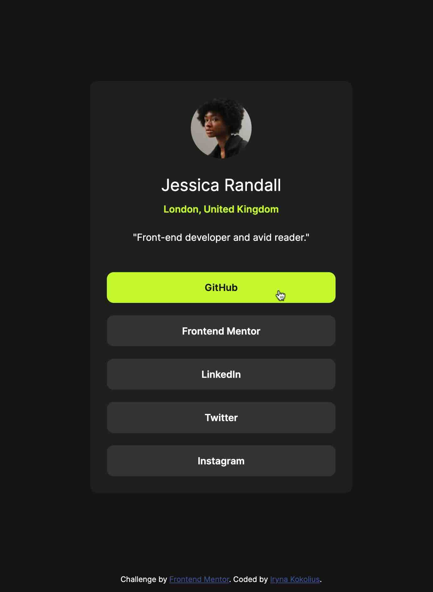

# Frontend Mentor - Social links profile solution

This is a solution to the [Social links profile challenge on Frontend Mentor](https://www.frontendmentor.io/challenges/social-links-profile-UG32l9m6dQ).

## Table of contents

- [Overview](#overview)
  - [The challenge](#the-challenge)
  - [Screenshot](#screenshot)
  - [Links](#links)
- [My process](#my-process)
  - [Built with](#built-with)
  - [What I learned](#what-i-learned)
- [Author](#author)

## Overview

### The challenge

Users should be able to:

- See hover and focus states for all interactive elements on the page

### Screenshot

### Links

- Solution URL: [GitHub](https://github.com/ikokolius/social-links-profile)
- Live Site URL: [Live](https://ikokolius.github.io/social-links-profile)

## My process

### Built with

- Semantic HTML5 markup
- CSS custom properties
- Flexbox
- Mobile-first workflow

### What I learned

I learned to work with Design files in JPEG format, without Figma dimensions :-), and were training my eyes to notice details and estimate distances.

## Author

- LinkedIn - [Iryna Kokolius](https://www.linkedin.com/in/iryna-kokolius/)
- Frontend Mentor - [Iryna Kokolius](https://www.frontendmentor.io/profile/ikokolius)
